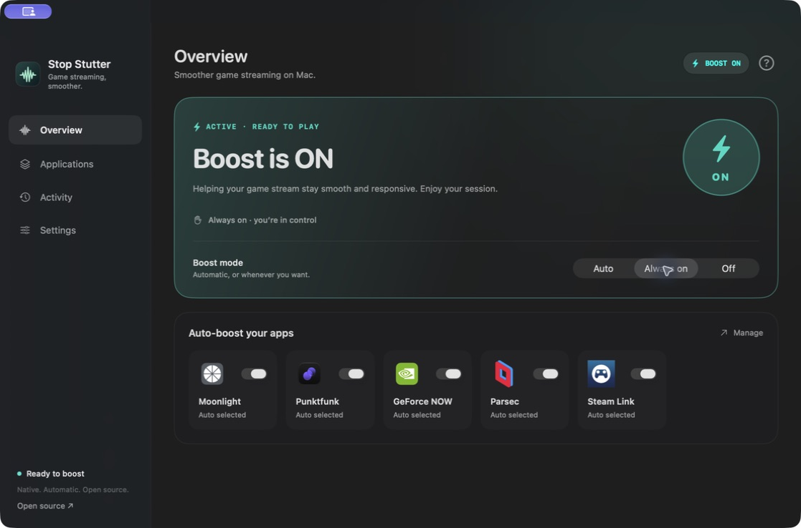
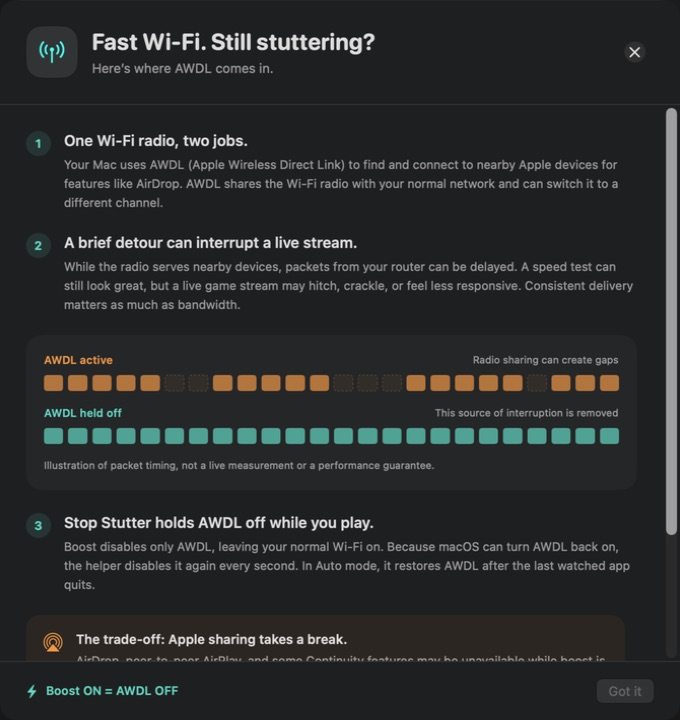
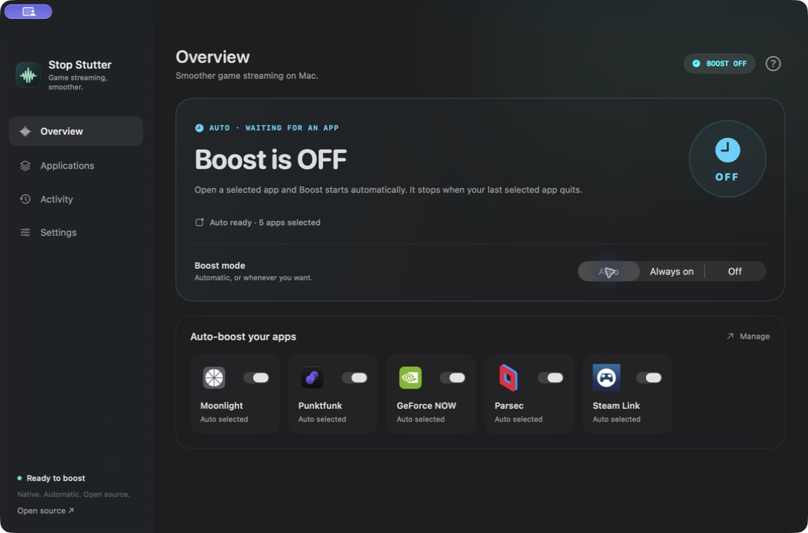
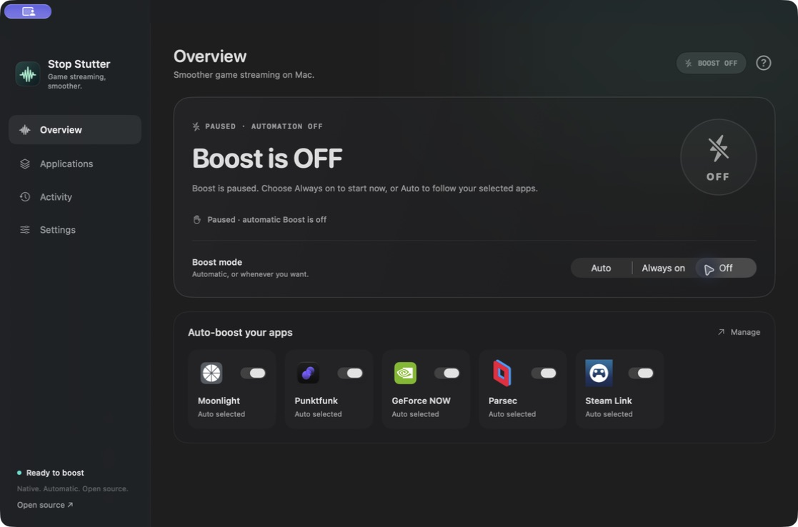

<div align="center">

# Stop Stutter

### Smoother game streaming on Mac.

**A native, automatic streaming boost for Moonlight, GeForce NOW, Punktfunk, Parsec, and Steam Link.**

Open your game. Boost kicks in. Quit when you’re done.

[](https://github.com/burakgon/stop-stutter/releases)
[](https://developer.apple.com/xcode/swiftui/)
[](LICENSE)
[](https://github.com/burakgon/stop-stutter/actions/workflows/ci.yml)

[**Download for Mac**](https://github.com/burakgon/stop-stutter/releases/latest) · [How it works](#how-it-works) · [Build from source](#build-from-source) · [Report an issue](https://github.com/burakgon/stop-stutter/issues/new/choose)

</div>



**Good signal. Plenty of bandwidth. Video still hitching every few seconds?** Your Mac’s peer-to-peer Wi-Fi may be getting in the way of your stream. When AWDL is the cause, turning it off can reduce latency spikes, uneven frame delivery, and audio interruptions. The issue has been [reported by Moonlight users for years](https://github.com/moonlight-stream/moonlight-qt/issues/753).

Stop Stutter makes that workaround effortless. **Open a selected app → Boost starts. Quit the last selected app → Boost ends.** No Terminal commands to repeat. No setting to remember after every game.

| Built for your session | What you get |
| --- | --- |
| **Launch and play** | Automatic Boost for the apps you choose |
| **See it at a glance** | Clear **Boost ON / OFF**, with distinct Auto waiting and paused states |
| **Make it yours** | Five ready-made app presets, official client icons, and a native picker for any other client |
| **Understand the details** | A **?** button explains the mechanism, limits, and Apple sharing trade-off |

## Pick your streaming apps

| App | Use case |
| --- | --- |
| **Moonlight** | Stream games from your own PC |
| **GeForce NOW** | Cloud gaming on your Mac |
| **Punktfunk** | Game streaming from your PC |
| **Parsec** | Low-latency remote desktop and game streaming |
| **Steam Link** | Stream your Steam games to your Mac |

These presets identify the native clients automatically. Add other `.app` bundles from **Applications → Add App**. Existing selections stay yours; missing presets are available under **More apps to boost**.

The benefit depends on whether AWDL causes your stutter. Preset support means automatic app detection, not a measured performance gain for each client. See the [validation record](docs/VALIDATION.md) for what has actually been tested.

## Why can AWDL cause lag?

**One radio, two jobs.** AWDL—Apple Wireless Direct Link—is the peer-to-peer interface used by AirDrop and related Apple features. It shares the Mac’s Wi-Fi radio with the connection to your router. AWDL’s discovery and communication schedule can take the radio onto a different channel, leaving normal network packets waiting. The protocol’s channel switching is described in [AWDL research](https://arxiv.org/abs/1808.03156), and [Apple’s networking engineers explain that peer-to-peer Wi-Fi can also add latency to infrastructure traffic](https://developer.apple.com/forums/thread/751839).

**A live stream notices short delays.** Downloads can buffer and catch up. A game stream needs frames, audio, and inputs delivered consistently. Those brief interruptions can feel like stutter even when a speed test reports excellent bandwidth.

**Stop Stutter removes this source of interference.** While boost is on, its helper disables `awdl0` every second. Your normal Wi-Fi remains on. In Auto mode it brings AWDL back after the final watched app quits, so Apple sharing can resume.

```text
BOOST OFF                          BOOST ON
AWDL can share the Wi-Fi radio      AWDL is held off every second
         ↓                                  ↓
AWDL-related delays can occur       This source of interference is reduced

                 Quit your watched apps
                          ↓
                 AWDL comes back on
```

**The trade-off:** AirDrop, peer-to-peer AirPlay, and some Continuity features may be unavailable while AWDL is off. Turn boost off whenever you need them. The **?** button in the app explains this with an illustrated walkthrough.

<details>
<summary>See the in-app explanation</summary>



</details>

## What you get

- **Automatic Boost.** Moonlight, GeForce NOW, Punktfunk, Parsec, and Steam Link are included. Add any `.app` with the native application picker.
- **One-second enforcement.** The helper repeats `/sbin/ifconfig awdl0 down` every second while boost is active, because macOS can bring the interface back up.
- **Manual control.** Choose **Always on** to hold AWDL off, **Off** to stop boost, or **Auto** to follow your selected apps.
- **States you can read at a glance.** Green **Boost is ON** means a verified active session. Blue **OFF / Auto waiting** is ready for your next app launch. Gray **OFF / Paused** means automation is disabled. Setup, transitions, and errors have their own labels.
- **An explanation built in.** The **?** panel shows why AWDL can cause lag, how boost helps, and what happens to Apple sharing.
- **Native Liquid Glass.** SwiftUI, real macOS 26+ glass controls, and native materials on macOS 14–15. Supports the system appearance and accessibility settings.
- **A quiet menu bar companion.** Close the main window and boost keeps working. Optional launch at login.
- **Clear notifications.** Quiet banners when Boost starts, ends, or needs attention. No notification sounds over your stream.
- **Recovery built in.** Disconnect recovery, six-second leases, and a durable recovery marker help prevent AWDL from being left off after a crash.
- **No accounts, analytics, ads, or dependencies.** App choices stay in local preferences. Activity history exists only in memory.

## Install

1. Download the universal ZIP from [Releases](https://github.com/burakgon/stop-stutter/releases/latest) and extract it.
2. Move **Stop Stutter.app** to **Applications**, then open it.
3. Click **Enable Helper**. Approve Stop Stutter under **System Settings → General → Login Items & Extensions** when macOS asks. Administrator approval is required for the helper.
4. Allow notifications if you want session updates.
5. Choose **Auto**, then open Moonlight, GeForce NOW, or another selected app.

Release builds are signed with Developer ID and notarized by Apple. The universal binary supports Apple Silicon and Intel. **macOS 14 Sonoma or later** is required; Liquid Glass requires **macOS 26 Tahoe or later**.

### Choose when boost runs

| Mode | Behavior |
| --- | --- |
| **Auto** | Holds AWDL off while at least one enabled app is running. Restores it when the last one quits. |
| **Always on** | Holds AWDL off until you change the mode or quit Stop Stutter. |
| **Off** | Releases Stop Stutter’s control and pauses automatic boost. |

Use **Applications → Add App** to select a client. Apps are matched by bundle identifier, so moving or renaming an app does not break its rule. Toggle a rule off to keep it in the list without triggering boost. Multiple selected clients can run at the same time.

**App lifetime, not stream detection:** boost starts when the client launches, including its menus, and stays on while it runs in the background. Closing its last window may not quit the client. Use **Quit** in that client to end its session.

Whole browsers and the Steam launcher are not presets: they often stay open outside a streaming session. For browser-based cloud gaming, use **Always on** during play or add your browser as a custom rule if you prefer that behavior.

**Auto is selected, but boost says OFF?** That is expected when none of your watched apps is running. Auto is a rule; the large status shows whether boost is actually active right now. A selected mode alone is never treated as proof that AWDL was disabled.

<details>
<summary>Compare Auto waiting and paused boost</summary>

**Auto waiting:** boost is off now, but a watched app will start it.



**Paused:** boost is off, and app launches will not start it.



</details>

### What happens to AirDrop?

AirDrop, peer-to-peer AirPlay, and some Continuity features may be unavailable while AWDL is held off. Your regular Wi-Fi interface is not disabled. Stop Stutter restores AWDL when its boost ends; it does not change Bluetooth, Location Services, your router, or SIP.

## How it works

```text
Selected apps launch / quit
           │
           ▼
    Native SwiftUI app ── authenticated XPC ──► macOS-managed helper
           │                                     │
      2-second heartbeat                   1-second enforcement
                                                 │
                                       /sbin/ifconfig awdl0 down
                                                 │
                             Last client quits / lease expires / app quits
                                                 │
                                       /sbin/ifconfig awdl0 up
```

The helper uses Apple’s [`SMAppService`](https://developer.apple.com/documentation/servicemanagement/smappservice) rather than a passwordless sudo rule. The app runs as your normal user; the small helper runs with permission to change AWDL. Both ends validate the peer’s Apple code signature, exact identifier, and signing team using the [public XPC code-signing APIs](https://developer.apple.com/documentation/foundation/nsxpcconnection/setcodesigningrequirement(_:)).

Only a boolean boost request crosses XPC. The helper accepts no command strings, custom interfaces, executable paths, or shell arguments. Read [the architecture and security notes](docs/ARCHITECTURE.md) for failure handling and limitations.

### If something interrupts your session

- **Normal quit or XPC disconnect:** the helper releases the app’s lease and restores AWDL when no other lease remains.
- **Frozen app:** a lease expires six seconds after the last heartbeat. The next one-second tick attempts recovery.
- **Helper crash:** launchd restarts the helper. A root-owned recovery marker tells it to restore AWDL before taking new work.
- **Sleep or user switching:** the app releases boost. Continuous monotonic lease time also expires across sleep; active rules are evaluated again on wake.
- **Restore failure:** the marker stays in place, the helper retries, and the app shows the error. It does not report success from an exit code alone.

The helper changes nothing while idle unless it owns a pending recovery. After taking control it restores AWDL to **up**, even if another tool had previously brought it down. Avoid running competing AWDL controllers. A missing interface, an OS failure, or removal of the helper/app before recovery completes can prevent automatic restoration; [manual recovery](#manual-recovery) is always available.

## Build from source

Use **Xcode 26 or later**, with its Command Line Tools selected. The package has no third-party dependencies.

```bash
git clone https://github.com/burakgon/stop-stutter.git
cd stop-stutter
swift test
./scripts/build.sh
open "build/Stop Stutter.app"
```

The default build is an **ad-hoc signed UI preview**. Privileged helper access is deliberately unavailable for ad-hoc builds. To test the helper, sign with your own Apple Development or Developer ID certificate:

```bash
SIGNING_IDENTITY="Developer ID Application: Your Name (TEAMID)" \
  ./scripts/build.sh
```

Install the resulting app in `/Applications`. macOS may require notarization before approving a bundled daemon; use the [release instructions](docs/RELEASING.md) for a notarized build. Development code can also be opened in Xcode with `open Package.swift`; use the build script to assemble the complete app with its helper.

Set `UNIVERSAL=1` to build for both architectures. The build uses macOS APIs introduced in 26 behind availability checks and deploys to macOS 14.

## Remove

1. Open **Settings** in Stop Stutter and disable **Launch at login**, if enabled.
2. Click **Remove Helper**. The app first releases its lease and verifies that recovery has finished. Removal is blocked if another signed app session still owns boost.
3. Quit Stop Stutter and move it to the Trash.

Do this before deleting the app bundle: the helper lives inside it. The app does not install sudoers rules or separate scripts. An empty, root-owned recovery directory can remain at `/private/var/db/io.github.burakgon.StopStutter`; it has no running component.

### Manual recovery

Quit Stop Stutter, then run:

```bash
sudo /sbin/ifconfig awdl0 up
```

Verify the `UP` flag with `/sbin/ifconfig awdl0`. If another app is still requesting boost, release that session first or it will turn AWDL off again.

## Contributing

Bug reports with macOS version, Mac model, client name, and clear reproduction steps are especially useful. Please distinguish observed AWDL behavior from measured streaming improvements. See [CONTRIBUTING.md](CONTRIBUTING.md) and [the manual test checklist](docs/TESTING.md).

If this helps your stream, a star helps other Mac users find it. Share your results in an issue—especially if you can compare the same session with boost on and off.

## Credits & license

Inspired by the Mac streaming community’s investigations, including the [Moonlight issue](https://github.com/moonlight-stream/moonlight-qt/issues/753) and [AWDL troubleshooting notes](https://gist.github.com/kouwei32/c101be682fc2e433e153ea131798caec). Stop Stutter is an independent project, not affiliated with Apple or any of the supported streaming services. Product names and client icons belong to their respective owners. See [client icon sources and notices](Resources/ClientIcons/NOTICE.md).

[MIT](LICENSE) © 2026 Ali Burak Goncu.
